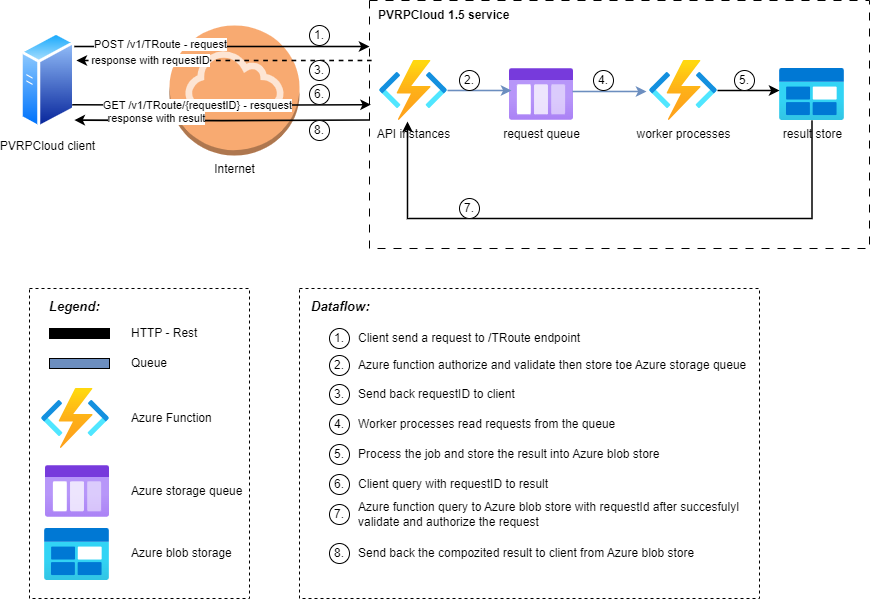

# PVRCloud

## Project board
https://github.com/orgs/SkillTech-Organization/projects/3/views/1

## Repositories
### PVRCloud WebAPI: https://github.com/SkillTech-Organization/PVRCloud.git

## Branching strategy
- branch for development: *develop*
- branch for customer test: *stage*
- branch for live environment: *main*

## Environments and access
- development: 
- customer test:
- live: *https://prvcloudwebapitest.azurewebsites.net/*

--- 

# From the Knowledge base

## Definitions Per Environment

### Prod - main branch (?) - *CURRENT STATE*

| Item              | Description                                             |
| ----------------- | ------------------------------------------------------- |
| Account           | ???                                                     |
| Management Group  | 8875ae16-2b24-4357-95a4-62e9df84fe06                    |
| Subscription      | 702fab27-7b08-4bcd-a29e-4c15e902dca2                    |
| Resource Group    | PRVPCloudResourceGroup                                  |
| Tenant ID         | 8875ae16-2b24-4357-95a4-62e9df84fe06                    |

### Resource Items

#### Live

| Resource Type       | Resource Name               | Description                    | Tags                     | note      |
| ------------------- | --------------------------- | ------------------------------ | ------------------------ | --------- |
| Managed Identity    | PRVPCloudWebAPIT-id-ae66    | RBAC role to deployment        | -                        |           |
| App Service         | prvpcloudwebapitest         | Application service            | -                        |           |
| App Service Plan    | PVRPCloudPlan               | Application service plan       | -                        |           |
| Storage Account     | pvrpcloudstoragetest        | Storage account                | -                        |           |
| Storage Container   | $logs                       | App Insight logs               | -                        |           |
| Storage Container   | azure-webjobs-dashboard     | Webjob dashboard data          | -                        |           |
| Storage Container   | calculations                | result data                    | -                        |           |
| Storage Container   | map                         | map data                       | -                        |           |
| Storage Container   | parameters                  | parameter set of the app       | -                        |           |
| Storage Queue       | pmapcalcinputmsgs           | request, input data            | -                        |           |
| Storage Queue       | pmapcalcinputmsgs-poison    | request, input data - DLQ      | -                        |           |
| Storage Queue       | pmapcalcinputmsgsdev        | request, input data TEST       | -                        | Deprecated|
| Storage Queue       | pmapcalcinputmsgsdev-poison | request, input data TEST - DLQ | -                        | Deprecated|
| Storage Queue       | pmapcalcoutputmsgs          | response, output data          | -                        |           |
| Storage Queue       | pmapcalcoutputmsgsdev       | response, output data TEST     | -                        | Deprecated|
| Application Insights| PVRPCloudAppInsightDev      | trace data                     | -                        |           |
| Runbook | prvpcloudwebapitest_start_automation_job|scheduled:mon-fri 08:00|-|Move it to PRVPCloudResourceGroup! |
| Runbook | prvpcloudwebapitest_stop_automation_job|scheduled:mon-fri 20:00|-|Move it to PRVPCloudResourceGroup! |

---

## PVRPCLoud 1.5 Project

###
Architecture

### planned resource and components
#### for test
- sktc-prtx-pvcld-pvrpcldapi15-tst-rsgrp-01 --> resource group
- sktc-prtx-pvcld-pvrpcldapi15_api-tst-fapp-01 --> azure function (API)
- sktc-prtx-pvcld-pvrpcldapi15_wrkr-tst-fapp-01 --> azure function (worker)
- sktc-prtx-pvcld-pvrpcldapi15-tst-blbstrg-01 --> blob storage
- sktc-prtx-pvcld-pvrpcldapi15-tst-qstrg-01 --> queue storage
- sktc-prtx-pvcld-pvrpcldapi15-tst-stac-01 --> storage account

#### for prod
- sktc-prtx-pvcld-pvrpcldapi15-prd-rsgrp-01 --> resource group
- sktc-prtx-pvcld-pvrpcldapi15_api-prd-fapp-01 --> azure function (API)
- sktc-prtx-pvcld-pvrpcldapi15_wrkr-prd-fapp-01 --> azure function (worker)
- sktc-prtx-pvcld-pvrpcldapi15-prd-blbstrg-01 --> blob storage
- sktc-prtx-pvcld-pvrpcldapi15-prd-qstrg-01 --> queue storage
- sktc-prtx-pvcld-pvrpcldapi15-prd-stac-01 --> storage account